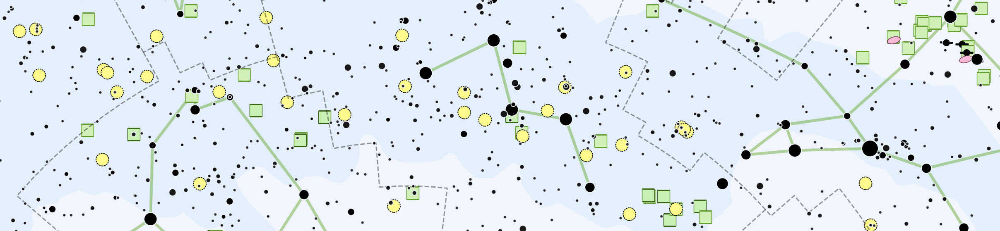

Hi 👋 I'm Steve Berardi, a software engineer that lives in a sunny suburb of San Diego, California. ☀️ 🌴

I'm also an amateur astronomer, and I love creating maps of the sky.

---
### 🔭 I’m working on:

|       |  |
| ----------- | ----------- |
|       | [Starplot](https://github.com/steveberardi/starplot)       |
|    | [Sky Atlas](https://skyatlas.app/)        |
|    | [Big Sky Catalog](https://github.com/steveberardi/bigsky)       |

---

### 📫 Contact me @ [steveberardi.com/contact/](https://steveberardi.com/contact/)

